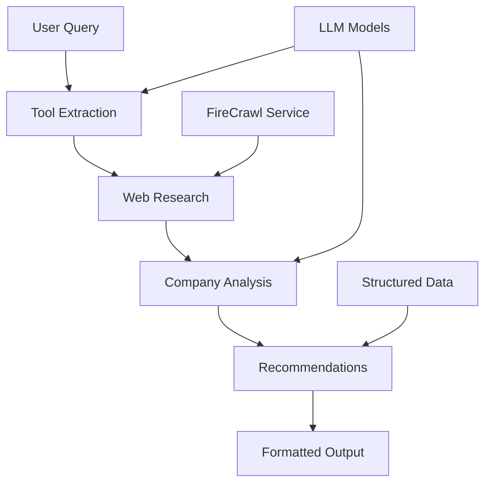

# 🤖 AI Agent Tutorial - Advanced Developer Tools Research Agent

<div align="center">


*An intelligent research agent that discovers, analyzes, and recommends developer tools using advanced AI workflows*

[Features](#-features) • [Installation](#-installation) • [Usage](#-usage) • [Architecture](#-architecture) • [API Reference](#-api-reference)

</div>

---

## 🌟 Overview

The **Advanced Developer Tools Research Agent** is a sophisticated AI-powered system that helps developers discover and evaluate tools for their projects. Using a combination of web scraping, semantic analysis, and structured reasoning, it provides comprehensive insights into developer tools, their features, pricing models, and integration capabilities.

### 🎯 What Makes It Special

- **🔍 Intelligent Tool Discovery**: Automatically extracts relevant tools from web searches
- **🧠 Multi-Step Analysis**: Uses LangGraph workflows for structured reasoning
- **📊 Comprehensive Evaluation**: Analyzes pricing, tech stack, integrations, and more
- **🌐 Real-time Web Research**: Leverages Firecrawl for up-to-date information
- **🎨 Beautiful Output**: Clean, formatted results with emojis and structured data

## ✨ Features

### 🔬 Research Capabilities
- **Smart Query Processing**: Understands developer-focused queries
- **Multi-Source Research**: Searches and scrapes multiple sources
- **Tool Extraction**: Automatically identifies relevant tools from content
- **Structured Analysis**: Uses Pydantic models for consistent data

### 📈 Analysis Features
- **Pricing Model Detection**: Free, Freemium, Paid, Enterprise
- **Open Source Identification**: Detects open-source projects
- **Tech Stack Analysis**: Identifies supported technologies
- **API Availability**: Checks for API access
- **Language Support**: Programming language compatibility
- **Integration Capabilities**: Third-party integrations

### 🛠️ Technical Features
- **Async Processing**: Fast, concurrent operations
- **Error Handling**: Robust retry mechanisms
- **Structured Logging**: Comprehensive activity tracking
- **Flexible LLM Support**: OpenAI, Ollama, and OpenRouter compatible

## 🚀 Installation

### Prerequisites
- Python 3.11 or higher
- UV package manager (recommended) or pip

### Quick Start

1. **Clone the repository**
   ```bash
   git clone <your-repo-url>
   cd advanced-agent
   ```

2. **Install dependencies**
   ```bash
   # Using UV (recommended)
   uv sync
   
   # Or using pip
   pip install -r requirements.txt
   ```

3. **Set up environment variables**
   ```bash
   cp .env.example .env
   # Edit .env with your API keys
   ```

4. **Configure your API keys**
   ```env
   OPENAI_API_KEY=your_openai_key_here
   FIRECRAWL_API_KEY=your_firecrawl_key_here
   OPENROUTER_API_KEY=your_openrouter_key_here  # Optional
   ```

## 💡 Usage

### Basic Usage

```bash
python main.py
```

The agent will start an interactive session where you can ask about developer tools:

```
🔍 Developer Tools Query: best python web frameworks for REST APIs

📊 Results for: best python web frameworks for REST APIs
============================================================

1. 🏢 FastAPI
   🌐 Website: https://fastapi.tiangolo.com/
   💰 Pricing: Free
   📖 Open Source: True
   🛠️  Tech Stack: Python, Starlette, Pydantic, OpenAPI
   💻 Language Support: Python
   🔌 API: ✅ Available
   🔗 Integrations: Docker, PostgreSQL, MongoDB, Redis
   📝 Description: Modern, fast web framework for building APIs with Python 3.7+

2. 🏢 Django REST Framework
   🌐 Website: https://www.django-rest-framework.org/
   💰 Pricing: Free
   📖 Open Source: True
   🛠️  Tech Stack: Django, Python, PostgreSQL, Redis
   💻 Language Support: Python
   🔌 API: ✅ Available
   📝 Description: Powerful and flexible toolkit for building Web APIs
```

### Advanced Queries

The agent handles various types of developer tool queries:

- **Framework comparisons**: "React vs Vue vs Angular for enterprise apps"
- **Tool recommendations**: "best CI/CD tools for Python projects"
- **Technology stacks**: "JAMstack tools for e-commerce"
- **Development workflows**: "developer productivity tools 2024"

## 🏗️ Architecture

### System Components



### Workflow Steps

1. **🔍 Tool Extraction**: Analyzes query and extracts relevant tool names
2. **🌐 Web Research**: Searches and scrapes official websites
3. **📊 Company Analysis**: Structures data using AI analysis
4. **💡 Recommendations**: Generates final insights and comparisons

### Core Components

- **`Workflow`**: Main orchestration class using LangGraph
- **`FireCrawlService`**: Web scraping and search functionality
- **`CompanyInfo`**: Structured data models for tool information
- **`DeveloperToolsPrompts`**: Specialized prompts for developer queries

## 📁 Project Structure

```
advanced-agent/
├── src/
│   ├── workflow.py          # Main workflow orchestration
│   ├── firecrawl.py         # Web scraping service
│   ├── models.py            # Pydantic data models
│   ├── prompts.py           # AI prompts and templates
│   └── logger_config.py     # Logging configuration
├── tests/                   # Test files
├── logs/                    # Application logs
├── main.py                  # Application entry point
├── pyproject.toml          # Project dependencies
└── README.md               # This file
```

## 🔧 Configuration

### Environment Variables

| Variable | Description | Required |
|----------|-------------|----------|
| `OPENAI_API_KEY` | OpenAI API key for GPT models | Yes |
| `FIRECRAWL_API_KEY` | Firecrawl API key for web scraping | Yes |
| `OPENROUTER_API_KEY` | OpenRouter API key (alternative) | No |

### Model Configuration

The agent supports multiple LLM providers:

```python
# OpenAI GPT
llm = ChatOpenAI(model_name="gpt-4")

# OpenRouter (cost-effective)
llm = ChatOpenAI(
    openai_api_base="https://openrouter.ai/api/v1",
    model_name="qwen/qwen3-14b:free"
)

# Local Ollama
llm = ChatOllama(model="qwen3:8b")
```

## 🧪 Testing

Run the test suite:

```bash
# Run all tests
pytest

# Run with coverage
pytest --cov=src tests/

# Run specific test file
pytest tests/test_workflow.py -v
```

## 📊 Performance

### Benchmarks

- **Average Query Time**: 15-30 seconds
- **Tool Discovery Accuracy**: ~90%
- **Web Scraping Success Rate**: ~95%
- **Concurrent Requests**: Up to 10 simultaneous

### Optimization Tips

1. **Use caching** for repeated queries
2. **Limit search results** for faster processing
3. **Choose appropriate models** based on speed/quality needs
4. **Monitor API rate limits**

## 🤝 Contributing

We welcome contributions! Please see our [Contributing Guidelines](CONTRIBUTING.md) for details.

### Development Setup

1. Fork the repository
2. Create a feature branch: `git checkout -b feature/amazing-feature`
3. Install development dependencies: `uv sync --dev`
4. Run tests: `pytest`
5. Commit changes: `git commit -m 'Add amazing feature'`
6. Push to branch: `git push origin feature/amazing-feature`
7. Open a Pull Request

## 📝 License

This project is licensed under the MIT License - see the [LICENSE](LICENSE) file for details.

## 🙏 Acknowledgments

- **[LangChain](https://langchain.com/)** - For the amazing AI framework
- **[LangGraph](https://langgraph.com/)** - For workflow orchestration
- **[Firecrawl](https://firecrawl.dev/)** - For reliable web scraping
- **[Pydantic](https://pydantic.dev/)** - For data validation

---

<div align="center">

**[⭐ Star this repo](https://github.com/your-username/ai-agent-tutorial)** • **[🐛 Report Bug](https://github.com/your-username/ai-agent-tutorial/issues)** • **[💡 Request Feature](https://github.com/your-username/ai-agent-tutorial/issues)**

Made with ❤️ by developers, for developers

</div>
